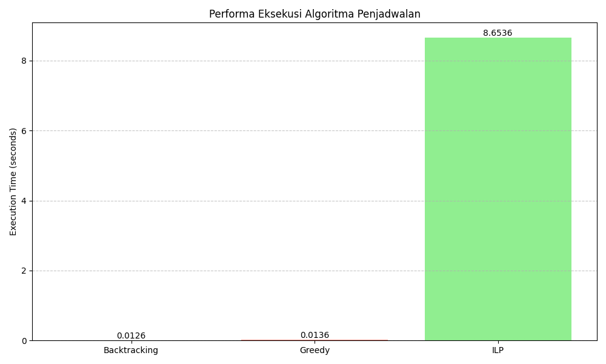
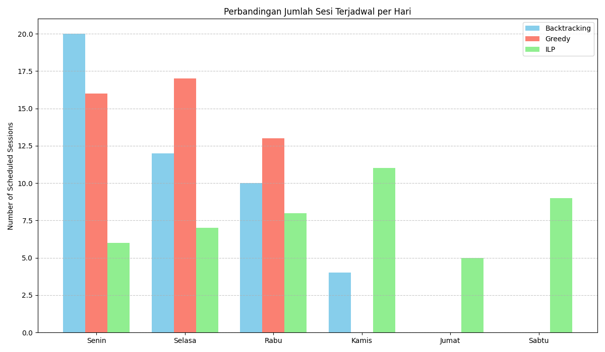
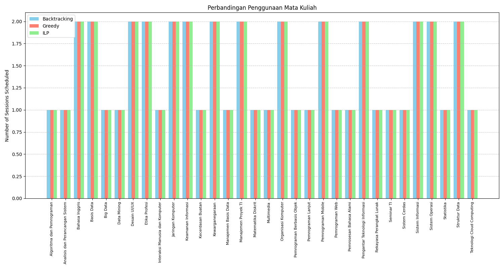
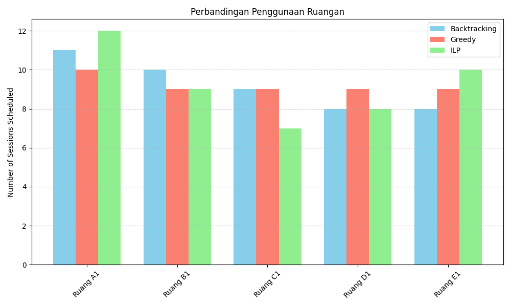
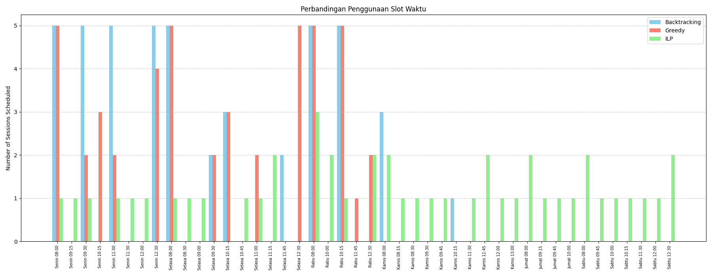

# Perbandingan 3 algoritma penjadwalan mata kuliah greedy, backtracking, dan ILP

## Deskripsi

Proyek ini membandingkan tiga algoritma penjadwalan mata kuliah: Greedy, Backtracking, dan Integer Linear Programming (ILP). Tujuan dari proyek ini adalah untuk mengevaluasi kinerja masing-masing algoritma dalam hal waktu eksekusi, jumlah sesi terjadwal, dan penggunaan sumber daya seperti
ruangan dan slot waktu.

## Studi Kasus

Studi kasus yang digunakan adalah penjadwalan mata kuliah di sebuah universitas dengan data yang mencakup:

- Jumlah Ruangan yang tersedia
- Jumlah Dosen
- Jumlah Mata kuliah
- Jumlah SKS mata kuliah
- Jumlah mahasiswa yang terdaftar di setiap mata kuliah
- Jumlah sesi yang diperlukan untuk setiap mata kuliah
- Slot waktu perkuliahan
- Kapasitas ruangan
- Hari dan jam kuliah

## Output yang diharapkan

Output dari program ini adalah laporan penjadwalan mata kuliah dalam format HTML yang mencakup:

- Ringkasan penjadwalan dari 3 algoritma
- Perbandingan waktu eksekusi algoritma
- Perbandingan jumlah sesi terjadwal per hari
- Perbandingan penggunaan mata kuliah
- Perbandingan penggunaan ruangan
- Perbandingan penggunaan slot waktu
- Grafik perbandingan performa algoritma
- Konflik yang ditemukan selama penjadwalan
- Gambar-gambar yang relevan untuk visualisasi hasil
- Laporan yang dihasilkan akan disimpan dalam folder `report/` dengan nama folder sesuai dengan tanggal dan waktu eksekusi.

## Struktur Proyek

``` is_directory
jadwal_matakuliah/
├── data/
│   └── dataset.json
│   └── report_template.html
├── algoritma/
│   ├── greedy.py
│   ├── backtracking.py
│   ├── ilp.py
│   └── dynamic_programming.py
├── report/
│   ├── automated generate folder report
│       └── report_files.html
│       └── images.png
├── main.py
├── requirements.txt
├── utils.py
└── README.md
```

## Instalasi dependensi

```bash
# Clone repository ini
git clone https://github.com/anasamu/algoritma_penjadwalan_matakuliah.git
# Buat virtual environment (opsional)
python -m venv venv

# Aktifkan virtual environment
source venv/bin/activate  # Linux/Mac
venv\Scripts\activate  # Windows

# Instal dependensi yang diperlukan
pip install -r requirements.txt
```

## Menyiapkan dataset

- Contoh Dataset
[dataset.json](data/dataset.json)

## Menjalankan program

```bash
python main.py
```

## Hasil Contoh program

Hasil program akan menghasilkan laporan penjadwalan mata kuliah dalam format HTML yang berisi:

- Perbandingan waktu eksekusi algoritma



- Perbandingan jumlah sesi terjadwal per hari



- Perbandingan penggunaan mata kuliah



- Perbandingan penggunaan ruangan



- Perbandingan penggunaan slot waktu



[Lihat output laporan](report/)
